<div align="center">

# ⚡🔥 ***BUILD FASTER. SHIP SMARTER. SCALE WITH AI.*** 🔥⚡

### ***Sovereign AI Systems • Autonomous Multi-Agent Swarms • High-Velocity Edge Deployments***

<p align="center">
  
</p>

<br/>

<!-- TOP ACTION BADGES -->
<a href="https://nealfrazier.tech">
  
</a>
&nbsp;&nbsp;
<a href="https://757tech.pro">
  
</a>
&nbsp;&nbsp;
<a href="https://nullai.tech">
  
</a>
&nbsp;&nbsp;
<a href="https://join.netlify.com/yoso7wqaix15">
  
</a>

<br/><br/>

<!-- CYBERNETIC APEX REACTOR ANIMATED SVG -->
<svg width="220" height="220" viewBox="0 0 200 200" style="margin: 0 auto; display: block;">
  <defs>
    <radialGradient id="reactorGlow" cx="50%" cy="50%" r="50%">
      <stop offset="0%" stop-color="#00E5FF" stop-opacity="0.8"/>
      <stop offset="50%" stop-color="#a855f7" stop-opacity="0.3"/>
      <stop offset="100%" stop-color="#03050a" stop-opacity="0"/>
    </radialGradient>
    <filter id="neonBlur" x="-20%" y="-20%" width="140%" height="140%">
      <feGaussianBlur stdDeviation="3" result="blur" />
      <feComposite in="SourceGraphic" in2="blur" operator="over" />
    </filter>
  </defs>

  <!-- Ambient background glow -->
  <circle cx="100" cy="100" r="90" fill="url(#reactorGlow)" />

  <!-- Outer Orbit Ring with Dash Animation -->
  <circle cx="100" cy="100" r="82" fill="none" stroke="#00E5FF" stroke-width="1.5" stroke-dasharray="6,8" opacity="0.6">
    <animateTransform attributeName="transform" type="rotate" from="0 100 100" to="360 100 100" dur="20s" repeatCount="indefinite"/>
  </circle>

  <!-- Mid Segmented Ring (Clockwise) -->
  <circle cx="100" cy="100" r="68" fill="none" stroke="#ff3b81" stroke-width="2" stroke-dasharray="24,12,6,12" opacity="0.7" filter="url(#neonBlur)">
    <animateTransform attributeName="transform" type="rotate" from="0 100 100" to="360 100 100" dur="12s" repeatCount="indefinite"/>
  </circle>

  <!-- Inner Counter-Rotating Telemetry Ring -->
  <circle cx="100" cy="100" r="52" fill="none" stroke="#a855f7" stroke-width="2" stroke-dasharray="14,14" opacity="0.8">
    <animateTransform attributeName="transform" type="rotate" from="360 100 100" to="0 100 100" dur="8s" repeatCount="indefinite"/>
  </circle>

  <!-- Core Pulsing Reactor -->
  <circle cx="100" cy="100" r="32" fill="#090d18" stroke="#00E5FF" stroke-width="2.5" filter="url(#neonBlur)">
    <animate attributeName="r" values="32;36;32" dur="2s" repeatCount="indefinite"/>
    <animate attributeName="stroke" values="#00E5FF;#ff3b81;#a855f7;#00E5FF" dur="6s" repeatCount="indefinite"/>
  </circle>

  <!-- Swarm Orbital Nodes -->
  <g>
    <animateTransform attributeName="transform" type="rotate" from="0 100 100" to="360 100 100" dur="6s" repeatCount="indefinite"/>
    <!-- Node 1: Antigravity -->
    <circle cx="100" cy="32" r="5" fill="#00E5FF" filter="url(#neonBlur)"/>
    <!-- Node 2: Hermes -->
    <circle cx="168" cy="100" r="4.5" fill="#ff3b81" filter="url(#neonBlur)"/>
    <!-- Node 3: Grok -->
    <circle cx="100" cy="168" r="5" fill="#a855f7" filter="url(#neonBlur)"/>
    <!-- Node 4: Ollama -->
    <circle cx="32" cy="100" r="4.5" fill="#10b981" filter="url(#neonBlur)"/>
  </g>

  <!-- Central Apex Glyph -->
  <text x="100" y="108" text-anchor="middle" font-family="monospace" font-size="24" font-weight="900" fill="#00E5FF">⚡</text>
</svg>

</div>

---

<div align="center">

## 👋 ***Hey, I'm Neal Frazier*** `(@1nc0gn30)`

### ***Sovereign AI Architect • Multi-Agent Systems Engineer • Full-Stack Edge Builder***
#### *Founder of [NullAI / Zoth Studio](https://nullai.tech) • Systems Architect at [Tech Pro (757tech.pro)](https://757tech.pro)*

<br/>

<table align="center" width="100%">
<tr align="center">
<td width="33.3%">
<b>🖥️ Host Environment</b><br/>
<code>Parrot OS Linux (x86_64)</code><br/>
<small>Sovereign Bare-Metal Node</small>
</td>
<td width="33.3%">
<b>🛰️ Swarm Plane (:8989)</b><br/>
<code>ONLINE • AGY + Hermes + Grok</code><br/>
<small>Asynchronous Multi-Agent Bus</small>
</td>
<td width="33.3%">
<b>🔬 Math Observability</b><br/>
<code>3-Pillar Tensor Physics</code><br/>
<small>Attention (QKᵀ) • Gradients • Entropy</small>
</td>
</tr>
<tr align="center">
<td width="33.3%">
<b>🔐 Cryptographic Security</b><br/>
<code>Argon2id + XChaCha20</code><br/>
<small>Zero-Cloud Private Loopback</small>
</td>
<td width="33.3%">
<b>⚡ Production Velocity</b><br/>
<code>286+ Projects • 160+ Shipped</code><br/>
<small>Global Edge Deployments</small>
</td>
<td width="33.3%">
<b>🎯 Operational Mission</b><br/>
<code>High-Leverage Systems</code><br/>
<small>Eliminate Manual Bottlenecks</small>
</td>
</tr>
</table>

</div>

I don't just write software — I build **conversion machines**. I don't just deploy scripts — I orchestrate **autonomous multi-agent swarms and high-velocity operational leverage**.

Whether it's building sovereign AI studios with live tensor math telemetry, coordinating specialized LLM agents over asynchronous message buses, or deploying dozens of sub-second edge applications on global infrastructure, my thesis is simple: **Velocity beats hesitation. Ship live code.**

---

<div align="center">

# 📸 ***SYSTEM SHOWCASE & ARCHITECTURE VAULT***

### ***Direct Visual Telemetry Across The Sovereign Multi-Agent Ecosystem***

</div>

<br/>

<div align="center">
  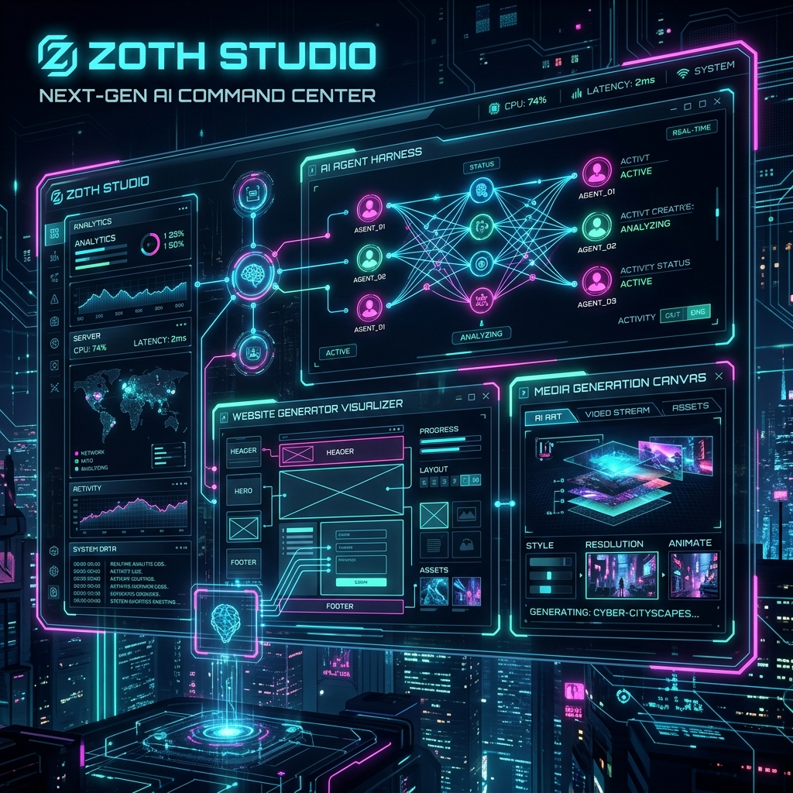
</div>

<br/>

<table align="center" width="100%">
<tr>
<td width="50%" align="center" valign="top">
  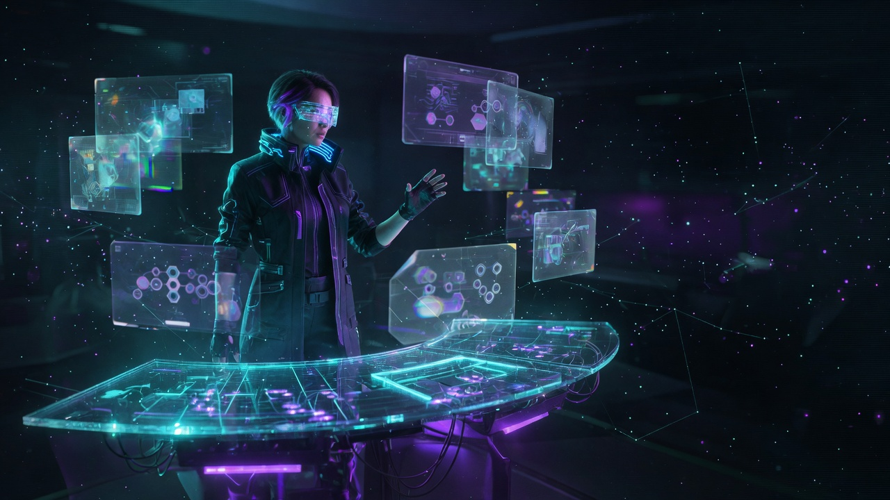
  <br/>
  <b>🖥️ Zoth Studio Operator Command Deck (Loopback :8484)</b>
  <p><small>Bare-metal control plane executing 47+ local CLIs, live terminal streams & encrypted tool runners.</small></p>
</td>
<td width="50%" align="center" valign="top">
  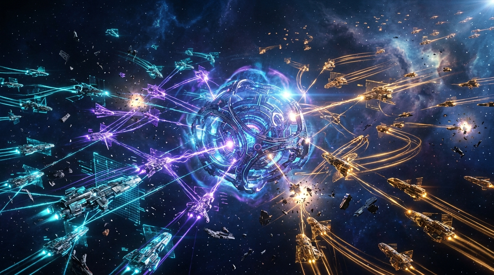
  <br/>
  <b>🛰️ 3D Kinetic Multi-Agent Swarm Arena</b>
  <p><small>Spatial coordination engine visualizing real-time agent tasks, thought trees, and message buses.</small></p>
</td>
</tr>
<tr>
<td width="50%" align="center" valign="top">
  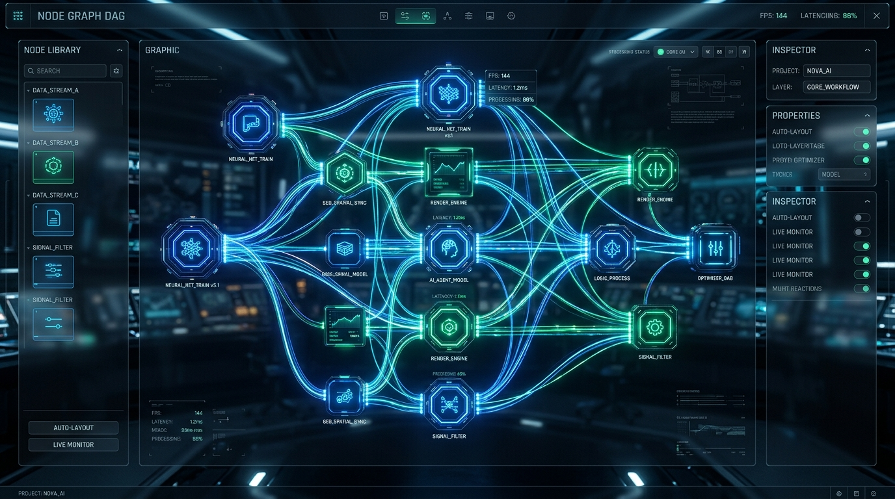
  <br/>
  <b>📐 Visual DAG Playbook Composer</b>
  <p><small>Interactive node graph chaining local LLMs, cloud frontiers, and security tools into deterministic playbooks.</small></p>
</td>
<td width="50%" align="center" valign="top">
  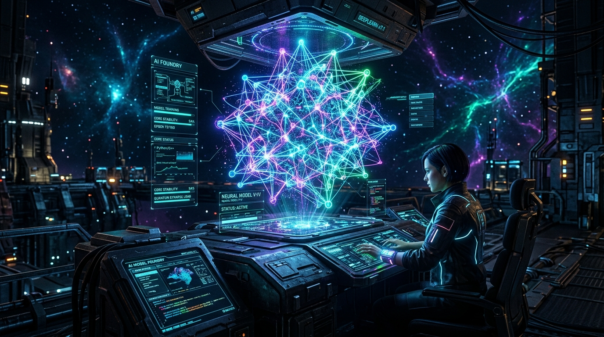
  <br/>
  <b>🧬 Sovereign Model Foundry & Cyber Spirits</b>
  <p><small>Nous Hermes, DeepSeek, Qwen, and custom LoRA adapters operating with specialized task spirits.</small></p>
</td>
</tr>
<tr>
<td width="50%" align="center" valign="top">
  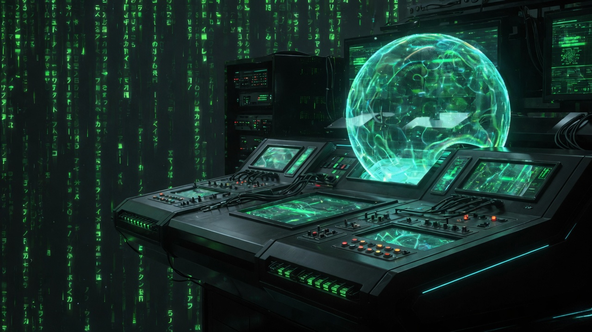
  <br/>
  <b>🛡️ 298+ Security & OSINT Tool Arsenal</b>
  <p><small>Integrated recon scanners, subdomain mapping, payload visualizers, and automated GRC auditors.</small></p>
</td>
<td width="50%" align="center" valign="top">
  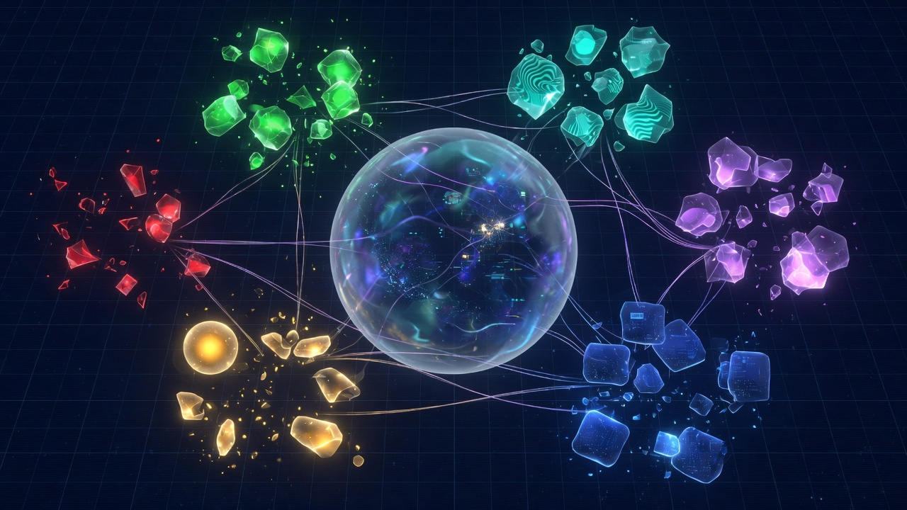
  <br/>
  <b>🗺️ 15-Category Master Project Constellation</b>
  <p><small>286+ projects tracked, 160+ shipped live across Astro, React, Netlify, Supabase, and Rust.</small></p>
</td>
</tr>
</table>

<br/>

<div align="center">

### 📂 ***Core Ecosystem Categories***

</div>

<table align="center" width="100%">
<tr align="center">
<td width="33.3%">
  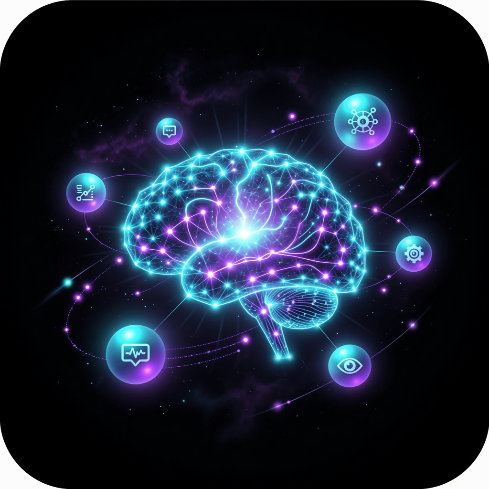<br/>
  <b>🤖 AI Agents & LLM Swarms</b>
</td>
<td width="33.3%">
  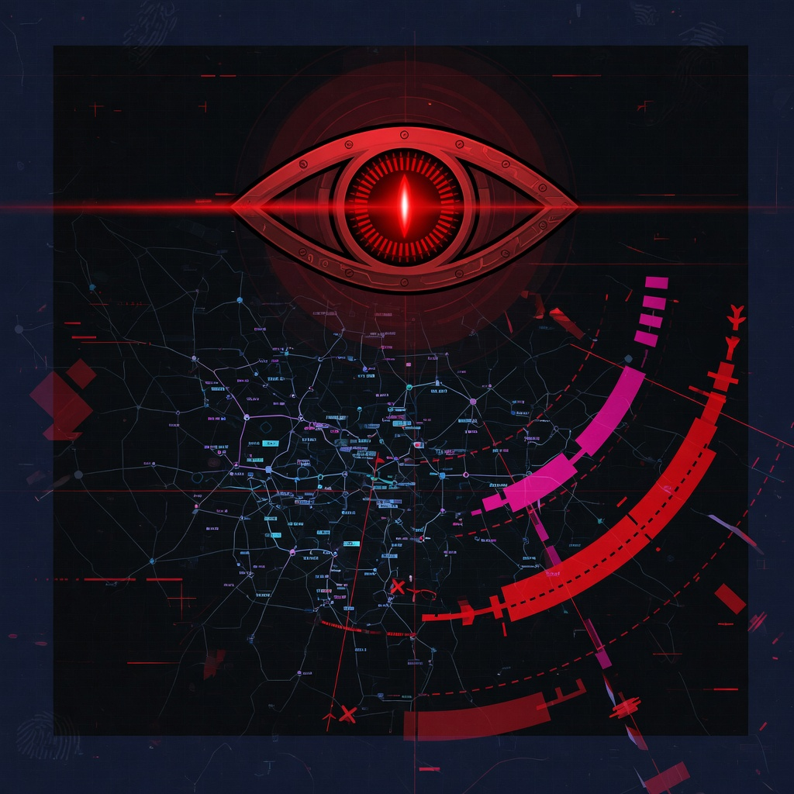<br/>
  <b>🔒 Security & OSINT Scanner</b>
</td>
<td width="33.3%">
  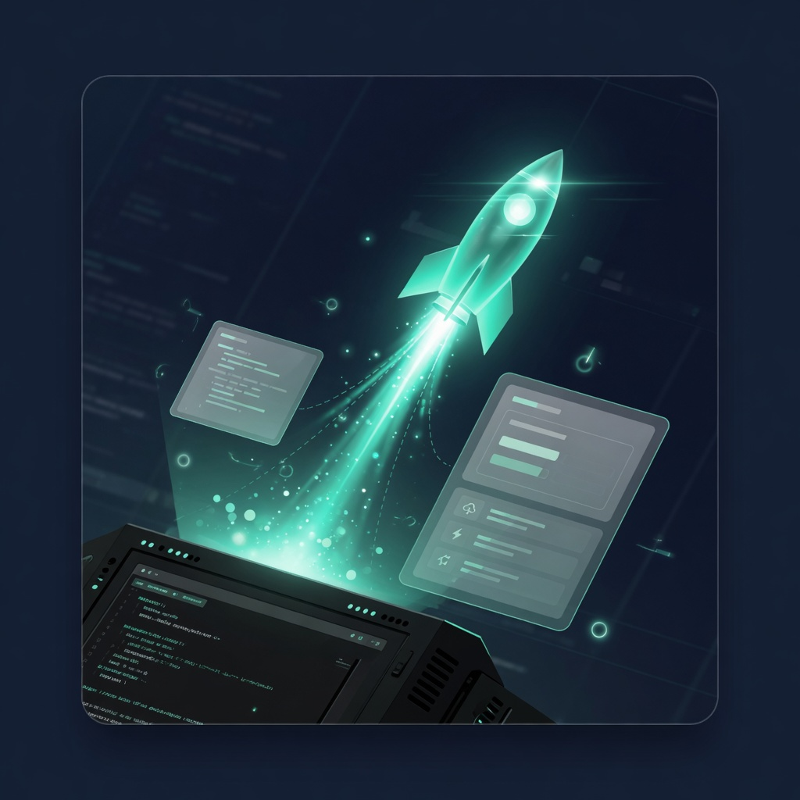<br/>
  <b>⚡ Edge & AX Creator Foundry</b>
</td>
</tr>
<tr align="center">
<td width="33.3%">
  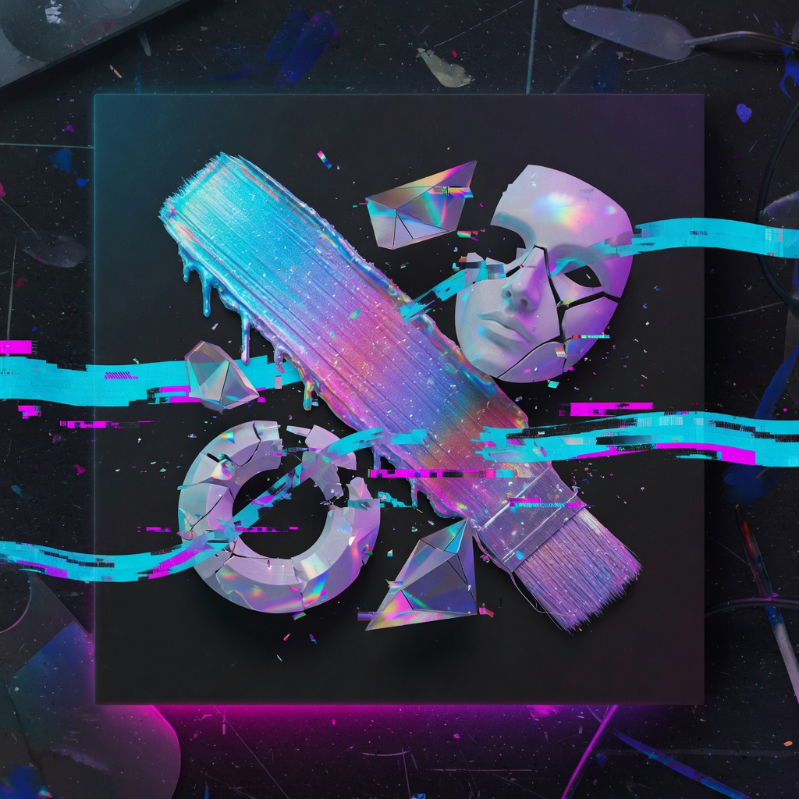<br/>
  <b>🎬 Creative Media & Video DSP</b>
</td>
<td width="33.3%">
  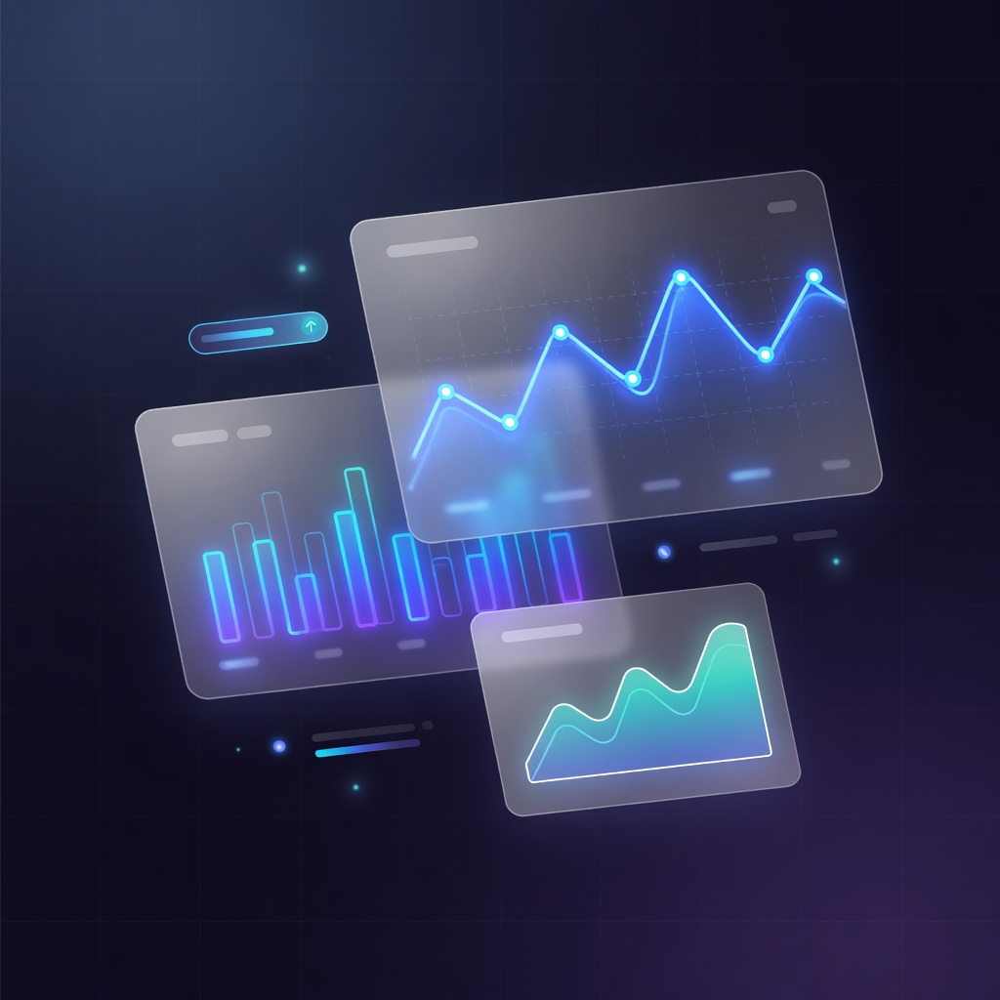<br/>
  <b>🌐 Web Apps & SaaS Engines</b>
</td>
<td width="33.3%">
  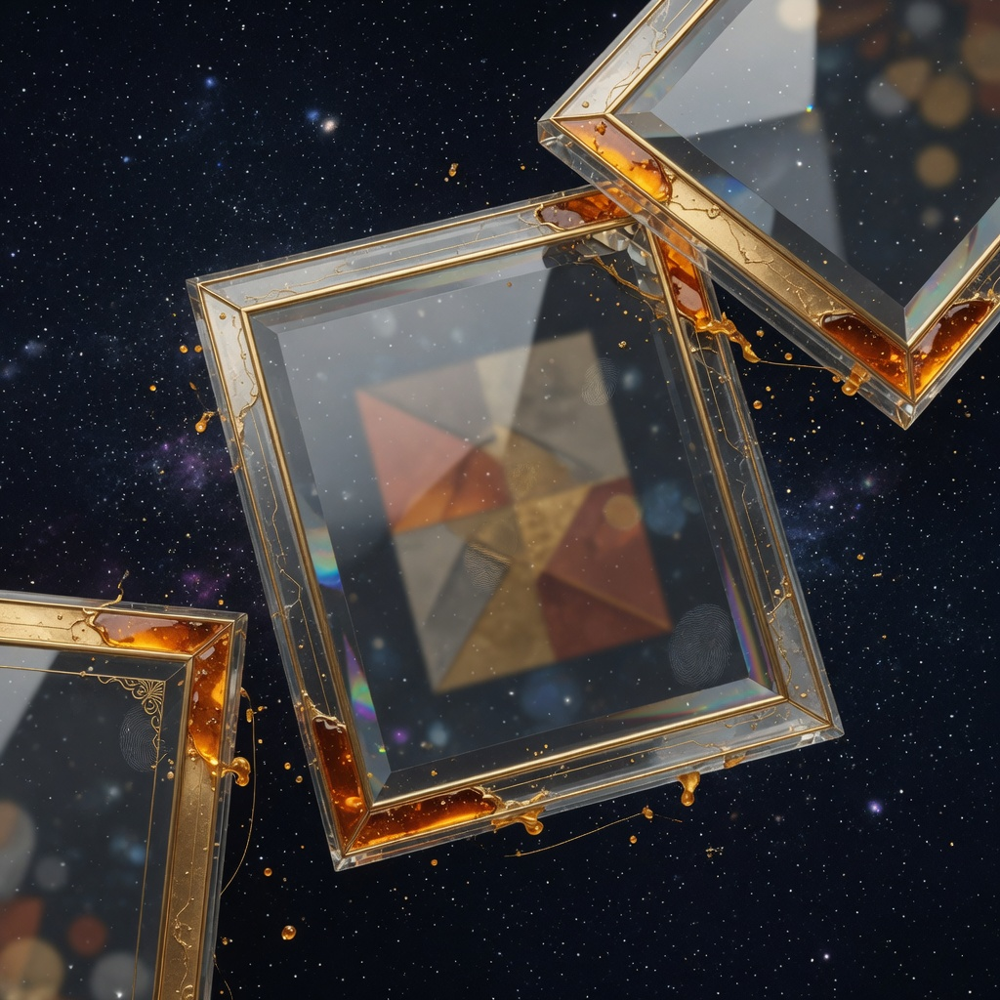<br/>
  <b>🚀 High-Converting Portfolios</b>
</td>
</tr>
</table>

---

<div align="center">

## ⚡ ***THE SIX PILLARS OF OPERATIONAL LEVERAGE***

</div>

| **Icon** | **Pillar** | **Core Architecture & Technology** | **Real-World Impact** |
|:---:|:---|:---|:---|
| 🤖 | ***Autonomous Multi-Agent Swarms*** | Antigravity (`agy`), Nous Hermes, Grok, Ollama (DeepSeek/Qwen), DSPy, FastMCP | Distributed agents executing complex DAG task chains autonomously |
| 🔬 | ***3-Pillar Math Observability*** | Scaled dot-product attention ($\text{softmax}(QK^T/\sqrt{d_k})V$), loss gradients, Shannon entropy | Physical telemetry inside every token generation; zero black-box obscurity |
| ⚡ | ***High-Velocity Edge Deployments*** | Astro, React 19, Vite, TypeScript, Netlify Edge Functions, Supabase Postgres RLS | Sub-second TTFB, instant global edge routing, and automated CI/CD pipelines |
| 🔒 | ***Zero-Cloud-Leak Sovereignty*** | Private loopback isolation (`127.0.0.1:8484`), Argon2id + XChaCha20 encrypted vaults | Complete IP and credential protection without third-party proxy exposure |
| 📈 | ***Autonomous Business Pipelines*** | 24/7 AI lead intake, real-time qualification engines, intelligent CRM syncing | <30-second inbound response times and zero leaked customer deals |
| 🎬 | ***Linux Creative & Video DSP*** | Computer vision cursor tracking, DSP web audio synthesis, OmniPost repurposing | Studio-grade video assets, automated 9:16 Shorts, and interactive 3D WebGL |

---

<div align="center">

## 🏛️ ***APEX PLATFORMS & FLAGSHIP INVENTIONS***

### ***Engineered, verified, and running live in production***

</div>

<table>
<tr>
<td width="50%" align="left" valign="top">

### 🔮 **[Zoth Studio & NullAI](https://nullai.tech)**
*Sovereign Local-First AI Powerhouse & Math Observability Studio*
- 🎯 **The Loopback Doctrine**: Complete local orchestration bound to `127.0.0.1:8484` with zero external telemetry leaks.
- 📐 **3-Pillar Math Engine**: Live visualization of transformer attention matrices, cross-entropy loss gradients, and Shannon entropy uncertainty.
- 🐝 **Multi-Agent Swarm Bus**: Inter-agent message plane (`:8989`) uniting Antigravity (`agy`), Nous Hermes, Grok, and local Ollama instances.
- 🔐 **Argon2id BYOK Vault**: Hardware-bound encryption for LLM keys and sensitive API tokens.
- 🌐 **Live Hubs**: [**`nullai.tech`**](https://nullai.tech) · [**`zoth.nealfrazier.tech`**](https://zoth.nealfrazier.tech)

</td>
<td width="50%" align="left" valign="top">

### 🤖 **[Tech Pro — AI Employee Systems](https://757tech.pro)**
*Autonomous 24/7 Operational Leverage for Growing Businesses*
- ⚡ **<30s Inbound Response**: AI intake agents that qualify leads instantly before they go cold.
- 💬 **Support & Knowledge Agents**: Conversational AI trained on business data to resolve customer tickets around the clock.
- 🔗 **Full-Fitted Workflows**: Automated calendar booking, CRM pipelines, follow-up sequencing, and lead scoring.
- 🛠️ **Bespoke Automation Stacks**: Custom operational software tailored for modern service & digital brands.
- 🌐 **Live Platform**: [**`757tech.pro`**](https://757tech.pro)

</td>
</tr>
<tr>
<td width="50%" align="left" valign="top">

### 🎬 **Maya Video Editor & Creative Suite**
*Linux-Native Motion Graphics, Recording & Synthesis Engine*
- 🎥 **Computer Vision Tracking**: Smooth cursor tracking, procedural focus zooms, and canvas rendering.
- 🔊 **Procedural Web Audio DSP**: Built-in soundboard, parametric filters, and synthesized soundscapes.
- 📱 **OmniPost Content Pipeline**: Auto-repurposes video into 16:9 widescreen, 9:16 vertical Shorts, and long-form teardowns.
- 🐧 **Parrot OS & Linux Optimized**: Built for direct bare-metal hardware acceleration.

</td>
<td width="50%" align="left" valign="top">

### 📱 **Zoth Signal Bridge & Swarm Remote**
*Android Remote Telemetry & Mobile Control Plane*
- 🛰️ **Live Agent Stream**: Real-time telemetry, agent thought logs, and execution traces pushed to mobile.
- 📡 **Remote Prompt & Steering**: Direct intervention and task assignment over secure local network channels.
- 🔔 **Autonomous Event Triggers**: Mobile push alerts for completed batch runs, security audit findings, and agent handoffs.

</td>
</tr>
</table>

---

<div align="center">

## 🎯 ***THE PROBLEM I SOLVE***

### ***Why Most Businesses and Systems Bleed Revenue and Momentum***

</div>

<table align="center" width="100%">
<tr>
<td align="left" width="50%">

### ❌ ***The Status Quo (Broken & Leaky)***

- 🚨 **Slow response times** → Leads wait hours; 80% go to competitors
- 📉 **Manual follow-ups** → Deals slip through cracks and revenue leaks
- 🔗 **Fragmented software** → Disconnected SaaS apps creating chaos
- 🐌 **Bloated websites** → Slow 4s+ loads that kill conversions
- ☁️ **Opaque cloud AI lock-in** → Leaked API keys, high bills, zero control

</td>

<td align="left" width="50%">

### ✅ ***The Sovereign Solution (High-Velocity)***

- ⚡ **<30s AI response time** → Immediate engagement and instant qualification
- 🤖 **24/7 AI employee systems** → Never sleep, never forget, never drop leads
- 🔌 **Unified automated pipelines** → Git-triggered edge deployments and CRM sync
- 🎨 **Sub-second edge speed** → Blazing-fast Astro/Vite sites with >95 Lighthouse scores
- 🔒 **Local-first multi-agent orchestration** → Full mathematical visibility and total privacy

</td>
</tr>
</table>

---

<div align="center">

# 🔥🚀 ***THE 100 WEBSITES IN 30 DAYS CHALLENGE*** 🚀🔥

### ***Proving That Deployment Velocity Beats Perfectionism Every Single Time***

<!-- KINETIC LAUNCH ANIMATED SVG -->
<svg width="240" height="150" viewBox="0 0 240 150" style="margin: 20px auto; display: block;">
  <defs>
    <linearGradient id="rocketGrad" x1="0%" y1="0%" x2="100%" y2="100%">
      <stop offset="0%" stop-color="#00E5FF" />
      <stop offset="100%" stop-color="#a855f7" />
    </linearGradient>
    <linearGradient id="flameGrad" x1="0%" y1="0%" x2="0%" y2="100%">
      <stop offset="0%" stop-color="#ff3b81" />
      <stop offset="50%" stop-color="#ffaa00" />
      <stop offset="100%" stop-color="#00E5FF" stop-opacity="0" />
    </linearGradient>
  </defs>

  <!-- Stars / Space particles -->
  <circle cx="30" cy="20" r="1.5" fill="#00E5FF" opacity="0.6"><animate attributeName="opacity" values="0.2;1;0.2" dur="1.5s" repeatCount="indefinite"/></circle>
  <circle cx="210" cy="35" r="1.5" fill="#ff3b81" opacity="0.8"><animate attributeName="opacity" values="0.8;0.2;0.8" dur="2s" repeatCount="indefinite"/></circle>
  <circle cx="70" cy="110" r="1" fill="#a855f7" opacity="0.5"/>
  <circle cx="180" cy="120" r="1" fill="#00E5FF" opacity="0.7"/>

  <!-- Rocket Body -->
  <path d="M 120 15 C 105 45, 100 80, 102 95 L 138 95 C 140 80, 135 45, 120 15 Z" fill="url(#rocketGrad)" stroke="#00E5FF" stroke-width="2"/>
  <!-- Nosecone accent -->
  <polygon points="120,15 110,40 130,40" fill="#03050a" opacity="0.4"/>
  <!-- Cockpit Window -->
  <circle cx="120" cy="55" r="8" fill="#03050a" stroke="#00E5FF" stroke-width="2"/>
  <circle cx="120" cy="55" r="4" fill="#00E5FF">
    <animate attributeName="r" values="3.5;5;3.5" dur="2s" repeatCount="indefinite"/>
  </circle>

  <!-- Fins -->
  <path d="M 102 75 L 85 98 L 102 95 Z" fill="#ff3b81"/>
  <path d="M 138 75 L 155 98 L 138 95 Z" fill="#ff3b81"/>

  <!-- Kinetic Exhaust Flames -->
  <path d="M 106 95 Q 120 145 120 140 Q 120 145 134 95 Z" fill="url(#flameGrad)">
    <animate attributeName="d" values="M 106 95 Q 120 148 120 140 Q 120 148 134 95 Z; M 106 95 Q 120 135 120 130 Q 120 135 134 95 Z; M 106 95 Q 120 148 120 140 Q 120 148 134 95 Z" dur="0.25s" repeatCount="indefinite"/>
  </path>
  <path d="M 112 95 Q 120 130 120 125 Q 120 130 128 95 Z" fill="#ffffff" opacity="0.9">
    <animate attributeName="d" values="M 112 95 Q 120 130 120 125 Q 120 130 128 95 Z; M 112 95 Q 120 120 120 115 Q 120 120 128 95 Z; M 112 95 Q 120 130 120 125 Q 120 130 128 95 Z" dur="0.2s" repeatCount="indefinite"/>
  </path>
</svg>

<p align="center">
  
  
  
  
</p>

</div>

<div align="center">

### ***The Builder's Creed: Ship > Overthink***

> ### ***"You don't get better at building by planning.***
> ### ***You get better by shipping."***

</div>

| **Principle** | **Why It Wins** | **Direct Outcome** |
|:---|:---|:---|
| ⚡ ***Execution Over Hesitation*** | Talk is cheap. Deployed code in production is irrefutable proof. | **_Unshakable credibility & live leverage_** |
| 🚀 ***Done Over Perfect*** | 80% live in user hands beats 100% trapped inside a local repo. | **_Compound momentum & faster learning_** |
| 🔄 ***Iteration Over Ego*** | Live user feedback immediately disproves theoretical assumptions. | **_Products improve 10x faster_** |
| 🛡️ ***Sovereignty Over Lock-in*** | Own your compute, keep keys local, control your destiny. | **_Zero outages, zero telemetry leaks_** |

---

<div align="center">

# ⚙️ ***THE TECHNICAL ARSENAL***

### ***Engineered for Speed, Scalability, and Mathematical Precision***

<p align="center">
  
</p>

</div>

<br/>

<div align="center">

| **Layer** | **Technologies & Frameworks** | **Specialized Implementation** |
|:---|:---|:---|
| 🤖 **AI & Swarm Engines** | **Antigravity (`agy`), Nous Hermes, Grok, Ollama, DeepSeek, DSPy, Axolotl, Unsloth** | Local multi-agent task DAGs, structured JSON generation, BYOK key vaults, fine-tuning |
| 🔬 **Observability & Math** | **Linear Algebra ($QK^T$), Multivariable Calculus ($\nabla L$), Shannon Entropy** | Live attention heatmaps, entropy token uncertainty, AdamW momentum telemetry |
| 🌐 **Frontend & 3D Web** | **Astro, React 19, Vite, TypeScript, Tailwind CSS, Three.js / R3F, Framer Motion** | Ultra-fast static sites, kinetic 3D WebGL arenas, cybernetic design systems |
| ⚡ **Backend & Edge** | **Node.js, Python 3.12, FastMCP, Netlify Functions & Edge, Supabase (Postgres & RLS)** | Serverless microservices, real-time database subscriptions, WebSocket message buses |
| 🔒 **Security & OSINT** | **Parrot Security OS, SubSweep, HexStrike, Argon2id, CISA GRC audit frameworks** | Attack surface discovery, local loopback encryption, automated vulnerability audits |
| 🚢 **DevOps & Infra** | **Docker, Netlify CI/CD, QEMU / KVM, Git, GitHub Actions, Linux** | Isolated testing sandboxes, automatic global edge builds, instant atomic rollbacks |

</div>

---

<div align="center">

# 🌐 ***FEATURED LIVE DEPLOYMENTS***

### ***Explore live products shipped across the ecosystem***

</div>

<div align="center">

| **Project** | **Category** | **Live URL** | **Highlights & Capabilities** |
|:---|:---|:---:|:---|
| 🏛️ **Zoth Studio Hub** | *AI / Developer Tools* | [**`nullai.tech`**](https://nullai.tech) | Local-first multi-agent studio, visual DAG composer, 3D kinetic arena |
| ⚡ **Tech Pro** | *AI Employee Systems* | [**`757tech.pro`**](https://757tech.pro) | 24/7 AI employee setups, lead intake engines & business automations |
| 🚀 **Neal Frazier Flagship** | *Personal Brand / Systems* | [**`nealfrazier.tech`**](https://nealfrazier.tech) | Conversion machines, client case studies, high-leverage software |
| 🕶️ **Hacker Portfolio v2** | *Cybersecurity / Portfolio* | [**`hacker-portfolio.757tech.pro`**](https://hacker-portfolio.757tech.pro) | Cybernetic interactive portfolio with live terminal interface |
| 🏛️ **Stoicism 3D Portal** | *3D WebGL / Philosophy* | [**`stoicism.nullai.tech`**](https://stoicism.nullai.tech) | Interactive Three.js particle canvas & Marcus Aurelius wisdom engine |
| 🎧 **SonicVision AI** | *Audio / Creative AI* | [**`sonicvision-ai.nullai.tech`**](https://sonicvision-ai.nullai.tech) | AI spectrogram visualizer and procedural sound studio |
| 📚 **Neal Bliki** | *Digital Garden / Knowledge* | [**`www.nullai.tech`**](https://www.nullai.tech) | Comprehensive knowledge base, essays, and architectural blueprints |

</div>

---

<div align="center">

# 🔒 ***SECURITY, ACCESSIBILITY & PERFORMANCE BASELINE***

### ***Non-Negotiable. Non-Compromisable. Applied to Every Deployment.***

```
✅ ZERO-CLOUD LEAKAGE        All sensitive keys & telemetry stay on loopback (127.0.0.1:8484)
✅ ENTERPRISE ENCRYPTION     Argon2id + XChaCha20-Poly1305 cryptographic vaults
✅ SUB-2S LOAD TIMES         Edge-rendered, assets compressed, sub-second TTFB worldwide
✅ WCAG 2.1 AA ACCESSIBLE    Keyboard navigability, high contrast ratios, screen reader ready
✅ SEO & AEO OPTIMIZED       Ranked for Google and optimized for Answer Engines (Perplexity/ChatGPT)
✅ ATOMIC ROLLBACKS          10-second instant recovery on all edge deployments
✅ ZERO-DOWNTIME CI/CD       Seamless background builds that never interrupt users
```

</div>

---

<div align="center">

# 📡 ***LET'S BUILD SOMETHING INSANE***

### ***Have a high-impact vision? Let's turn it into deployed reality.***

<br/>

<a href="https://nealfrazier.tech">
  
</a>
&nbsp;&nbsp;
<a href="https://757tech.pro">
  
</a>
&nbsp;&nbsp;
<a href="https://nullai.tech">
  
</a>
&nbsp;&nbsp;
<a href="mailto:business@nealfrazier.tech">
  
</a>

<br/><br/>

<!-- CYBERNETIC SINE-WAVE PULSE ANIMATED SVG -->
<svg width="300" height="90" viewBox="0 0 300 90" style="margin: 20px auto; display: block;">
  <defs>
    <filter id="waveGlow">
      <feGaussianBlur stdDeviation="2" result="blur" />
      <feComposite in="SourceGraphic" in2="blur" operator="over" />
    </filter>
  </defs>

  <!-- Cyan High-Frequency Wave -->
  <path d="M 0 45 Q 37.5 20 75 45 T 150 45 T 225 45 T 300 45" fill="none" stroke="#00E5FF" stroke-width="2.5" opacity="0.85" filter="url(#waveGlow)">
    <animate attributeName="d" values="M 0 45 Q 37.5 20 75 45 T 150 45 T 225 45 T 300 45; M 0 45 Q 37.5 70 75 45 T 150 45 T 225 45 T 300 45; M 0 45 Q 37.5 20 75 45 T 150 45 T 225 45 T 300 45" dur="3s" repeatCount="indefinite"/>
  </path>

  <!-- Magenta Low-Frequency Wave -->
  <path d="M 0 45 Q 37.5 32 75 45 T 150 45 T 225 45 T 300 45" fill="none" stroke="#ff3b81" stroke-width="2" opacity="0.65" filter="url(#waveGlow)">
    <animate attributeName="d" values="M 0 45 Q 37.5 32 75 45 T 150 45 T 225 45 T 300 45; M 0 45 Q 37.5 58 75 45 T 150 45 T 225 45 T 300 45; M 0 45 Q 37.5 32 75 45 T 150 45 T 225 45 T 300 45" dur="2.2s" repeatCount="indefinite"/>
  </path>

  <!-- Amethyst Slow Drift Wave -->
  <path d="M 0 45 Q 37.5 40 75 45 T 150 45 T 225 45 T 300 45" fill="none" stroke="#a855f7" stroke-width="1.5" opacity="0.5">
    <animate attributeName="d" values="M 0 45 Q 37.5 40 75 45 T 150 45 T 225 45 T 300 45; M 0 45 Q 37.5 50 75 45 T 150 45 T 225 45 T 300 45; M 0 45 Q 37.5 40 75 45 T 150 45 T 225 45 T 300 45" dur="4s" repeatCount="indefinite"/>
  </path>

  <!-- Kinetic Typography -->
  <text x="150" y="80" text-anchor="middle" font-family="monospace" font-size="13" font-weight="900" fill="#00E5FF" letter-spacing="3">SHIP FASTER • NEVER STOP</text>
</svg>

### ***Status: Building, Shipping & Orchestrating 24/7***
**_Updated: August 2026_**

---

### ***Crafted with ⚡ by Neal Frazier (`@1nc0gn30`)***
### ***Sovereign AI • Mathematical Observability • Deployed by Momentum***

</div>
