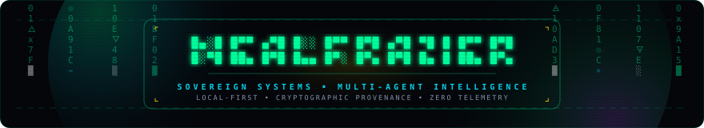

<div align="center">
  
</div>

# Neal Frazier

**Founder & Systems Architect • [Neal Frazier Tech](https://nealfrazier.tech) • [NullAI Platform](https://nullai.tech)**  
Virginia Beach, VA &bull; [@1nc0gn30](https://github.com/1nc0gn30) &bull; [𝕏 @NealFrazierTech](https://x.com/NealFrazierTech) &bull; [neal@nealfrazier.tech](mailto:neal@nealfrazier.tech)

---

### About

I design and build sovereign operating environments, autonomous multi-agent intelligence systems, and high-velocity digital infrastructure. My work bridges low-level systems engineering—from Linux kernel hardening and cryptographic vaults to in-browser neural workspaces and autonomous AI employees.

I believe in **radical engineering velocity, local-first utility, and cryptographic provenance**. Everything I build adheres to the zero-telemetry standard: private by default, verifiable by design, and engineered to run with real client-side utility rather than artificial cloud dependencies.

---

### Core Projects

| Project | Focus | Links |
| :--- | :--- | :--- |
| **ZothOS** | Sovereign Linux distribution purpose-built for autonomous AI agents, cryptographic vault isolation, and zero-telemetry research. Features KDE Plasma 6.3 Wayland, hardened kernel, and Sigstore provenance. | [Repository](https://github.com/NullAITech/zoth-os) &bull; [Documentation](https://github.com/NullAITech/zoth-os/blob/main/docs/BUILD_GUIDE.md) |
| **Zoth Studio** | Frontier multi-agent cognitive workspace, dynamic DAG composer, neural visualization arena, and real-time execution cockpit. | [Live Platform](https://zoth.nullai.tech) &bull; [Repository](https://github.com/NullAITech/zoth-studio-v2) |
| **757 Tech Pro** | Autonomous AI employee systems, high-converting digital architecture, and workflow automation for modern local enterprises. | [757tech.pro](https://757tech.pro) |
| **NullAI Platform** | Core research lab focused on verifiable software systems, local LLM orchestration, model context protocols (MCP), and mathematical observability. | [nullai.tech](https://nullai.tech) |
| **Neal Frazier Tech** | Personal engineering hub, technical writings, project showcases, and software releases. | [nealfrazier.tech](https://nealfrazier.tech) |

---

### Engineering Stack

- **Systems & Security**: Linux, Rust, Python, Go, C++, Cryptography (Argon2id, ChaCha20-Poly1305), Sigstore
- **Agentics & AI**: Multi-Agent Swarms, Model Context Protocol (MCP), Local LLMs (Ollama, vLLM), PyTorch
- **Web & Runtime**: TypeScript, React, Next.js, Node.js, Electron, Tailwind CSS, Netlify Edge

```text
┌──[ telemetry: sovereign-mesh ]──────────────────────────────────────────────────┐
│  node: 1nc0gn30 • zero-leak: 100% • provenance: sigstore+rekor • crypto: chacha │
└───────────────────────────────────────────────────────[ state: online / active ]┘
```

---

<div align="center">
  <sub>Engineered by Neal Frazier Tech (<a href="https://github.com/1nc0gn30">@1nc0gn30</a>) &bull; <a href="https://nealfrazier.tech">nealfrazier.tech</a> &bull; <a href="https://nullai.tech">nullai.tech</a></sub>
</div>
